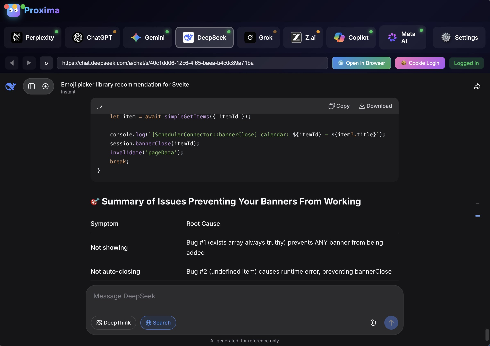

<div align="center">

# ⚡ Proxima

### Multi-AI Gateway — One API, All Models

[](https://github.com/Zen4-bit/Proxima/releases)
[](LICENSE)
[]()
[]()
[]()

Proxima acts like a connector browser to turn all your interactive AI browser sessions into an interactive endpoint for AI MCP's.
ChatGPT, Claude, Gemini, Perplexity, CoPilot, Deepseek, Z.ai, Meta.ai are all accessible as MCP. All you need to do is login to each of them in the Proxima browser shell. No API keys needed.

[Getting Started](#getting-started) · [API Usage](#api-usage) · [SDKs](#sdks) · [MCP Tools](#mcp-tools) · [Configuration](#configuration)

---

## Demo

https://github.com/user-attachments/assets/6eb76618-2c1d-4dad-b753-aaaee9e93310

---




</div>

## Overview

Proxima is a local AI gateway that connects multiple AI providers to your coding environment.

**One API. One URL. One function. Any model. Any task.**

```
POST /v1/chat/completions
{"model": "claude", "message": "Hello"}                                          → Chat
{"model": "perplexity", "message": "AI news", "function": "search"}              → Search
{"model": "gemini", "message": "Hello", "function": "translate", "to": "Hindi"}  → Translate
{"model": "claude", "message": "Sort algo", "function": "code"}                  → Code
```

> **No API keys required.** Proxima uses your existing browser sessions to talk to AI providers directly.

### Why Proxima?

| Feature | Description |
|---------|-------------|
| **One Endpoint** | Everything through `/v1/chat/completions` — no separate URLs |
| **4 AI Providers** | ChatGPT, Claude, Gemini, Perplexity — any model, any task |
| **45+ MCP Tools** | Search, code, translate, analyze, brainstorm — all via MCP |
| **REST API** | OpenAI-compatible API on `localhost:3210` |
| **SDKs** | Python & JavaScript — one function each |
| **No API Keys** | Use your existing account logins |
| **Local & Private** | Runs on localhost, your data stays on your machine |
| **Smart Router** | Auto-picks the best available AI for your query |

---

## What's New in v3.5.0

- 🆕 **27 new MCP tools** — content, analysis, file analysis, window control, session management
- 🆕 **REST API** — OpenAI-compatible endpoint at `localhost:3210`
- 🆕 **Python & JavaScript SDKs** — one function to do everything
- 🆕 **Smart Router** — auto-picks best AI with retry logic
- 🆕 **Math Search** — solve math & science problems step-by-step
- 🆕 **Image Search** — find images on any topic
- 🆕 **File Analysis** — upload and analyze local files with any AI
- 🆕 **Window Controls** — show, hide, toggle, headless mode
- 🔧 **Enhanced typing detection** — better response capture for all providers
- 🔧 **Claude code hack** — forces inline code instead of artifacts for reliable capture

---

## Getting Started

### Requirements

- **Windows 10/11 or Mac**
- **Node.js 18+** → [Download Node.js](https://nodejs.org/)

### Installation

<table>
<tr>
<td width="50%">

**Download Installer**

Download the latest release and run the installer.

[Download for Windows →](https://github.com/Zen4-bit/Proxima/releases)

</td>
<td width="50%">

**Run from Source**

```bash
git clone https://github.com/Zen4-bit/Proxima.git
cd proxima
npm install
npm start
```

</td>
</tr>
</table>

### Quick Setup

1. **Open Proxima** and login to your AI providers
2. **Copy MCP config** from Settings panel
3. **API is live** at `http://localhost:3210`

---

## Supported Providers

<table>
<tr>
<td align="center" width="25%">
<br>
<strong>ChatGPT</strong>
<br>
OpenAI's GPT-4
<br><br>
</td>
<td align="center" width="25%">
<br>
<strong>Claude</strong>
<br>
Anthropic's Claude
<br><br>
</td>
<td align="center" width="25%">
<br>
<strong>Gemini</strong>
<br>
Google's Gemini
<br><br>
</td>
<td align="center" width="25%">
<br>
<strong>Perplexity</strong>
<br>
Web search & research
<br><br>
</td>
</tr>
</table>

### Model Aliases

You can use familiar names — they all resolve to the right provider:

| Provider | Aliases |
|----------|---------|
| ChatGPT | `chatgpt`, `gpt`, `gpt-4`, `gpt-4o`, `openai` |
| Claude | `claude`, `anthropic`, `sonnet`, `opus`, `haiku` |
| Gemini | `gemini`, `google`, `bard`, `gemini-pro` |
| Perplexity | `perplexity`, `pplx`, `sonar` |
| Auto | `auto` — picks the best available |

---

## API Usage

### ONE Endpoint — Everything

```
POST http://localhost:3210/v1/chat/completions
Content-Type: application/json
```

The `"function"` field in the body determines what happens. No function = normal chat.

### Functions

| Function | Body Fields | What It Does |
|----------|-------------|-------------|
| *(none)* | `model`, `message` | Normal chat |
| `"search"` | `model`, `message`, `function` | Web search + AI analysis |
| `"translate"` | `model`, `message`, `function`, `to` | Translate text |
| `"brainstorm"` | `model`, `message`, `function` | Generate creative ideas |
| `"code"` | `model`, `message`, `function`, `action` | Code generate/review/debug/explain |
| `"analyze"` | `model`, `function`, `url` | Analyze URL or content |

### Examples (All Same URL)

**Chat:**
```bash
curl http://localhost:3210/v1/chat/completions \
  -H "Content-Type: application/json" \
  -d '{"model": "claude", "message": "What is AI?"}'
```

**Search:**
```bash
curl http://localhost:3210/v1/chat/completions \
  -d '{"model": "perplexity", "message": "AI news 2026", "function": "search"}'
```

**Translate:**
```bash
curl http://localhost:3210/v1/chat/completions \
  -d '{"model": "gemini", "message": "Hello world", "function": "translate", "to": "Hindi"}'
```

**Code Generate:**
```bash
curl http://localhost:3210/v1/chat/completions \
  -d '{"model": "claude", "message": "Sort algorithm", "function": "code", "action": "generate", "language": "Python"}'
```

**Code Review:**
```bash
curl http://localhost:3210/v1/chat/completions \
  -d '{"model": "claude", "function": "code", "action": "review", "code": "def add(a,b): return a+b"}'
```

**Brainstorm:**
```bash
curl http://localhost:3210/v1/chat/completions \
  -d '{"model": "auto", "message": "Startup ideas", "function": "brainstorm"}'
```

**Analyze URL:**
```bash
curl http://localhost:3210/v1/chat/completions \
  -d '{"model": "perplexity", "function": "analyze", "url": "https://example.com"}'
```

### Response Format

Every call returns the **same format**:

```json
{
  "id": "proxima-abc123",
  "model": "claude",
  "choices": [{
    "message": {
      "role": "assistant",
      "content": "AI response here..."
    }
  }],
  "proxima": {
    "provider": "claude",
    "responseTimeMs": 2400
  }
}
```

### System Endpoints

| Method | Endpoint | Description |
|--------|----------|-------------|
| `GET` | `/v1/models` | List models and their status |
| `GET` | `/v1/functions` | API function catalog |
| `GET` | `/v1/stats` | Response time stats |
| `POST` | `/v1/conversations/new` | Fresh start |

---

## SDKs

### Python SDK — One Function

```python
from proxima import Proxima
client = Proxima()

# Chat — any model
response = client.chat("Hello", model="claude")
response = client.chat("Hello", model="chatgpt")
response = client.chat("Hello", model="gemini")
response = client.chat("Hello")  # auto picks best
print(response.text)
print(response.model)
print(response.response_time_ms)

# Search — same function, add function="search"
result = client.chat("AI news 2026", model="perplexity", function="search")
print(result.text)

# Translate — same function, add function="translate"
hindi = client.chat("Hello world", model="gemini", function="translate", to="Hindi")
print(hindi.text)

# Code generate
code = client.chat("Sort algorithm", model="claude", function="code", action="generate", language="Python")

# Code review
review = client.chat(function="code", model="claude", action="review", code="def add(a,b): return a+b")

# Brainstorm
ideas = client.chat("Startup ideas", function="brainstorm")

# Analyze URL
analysis = client.chat(function="analyze", url="https://example.com")

# System
models = client.get_models()
stats = client.get_stats()
client.new_conversation()
```

**Installation:** `pip install requests`, then copy `sdk/proxima.py` to your project.

### JavaScript SDK — One Function

```javascript
const { Proxima } = require('./sdk/proxima');
const client = new Proxima();

// Chat — any model
const res = await client.chat("Hello", { model: "claude" });
console.log(res.text);

// Search
const news = await client.chat("AI news", { model: "perplexity", function: "search" });

// Translate
const hindi = await client.chat("Hello", { model: "gemini", function: "translate", to: "Hindi" });

// Code generate
const code = await client.chat("Sort algo", { model: "claude", function: "code", action: "generate" });

// Brainstorm
const ideas = await client.chat("Startup ideas", { function: "brainstorm" });

// Analyze
const analysis = await client.chat("", { function: "analyze", url: "https://example.com" });

// System
const models = await client.getModels();
const stats = await client.getStats();
```

Works with Node.js 18+ (uses native `fetch`).

### SDK Configuration

```python
# Custom URL
client = Proxima(base_url="http://192.168.1.100:3210")

# Default model for all calls
client = Proxima(default_model="claude")
```

---

## MCP Tools

### Configuration

Add this to your AI coding app's MCP settings:

```json
{
  "mcpServers": {
    "proxima": {
      "command": "node",
      "args": ["C:/path/to/proxima/src/mcp-server-v3.js"]
    }
  }
}
```

> **Tip:** Copy the exact path from Proxima's Settings panel.

### Compatible Apps

- **Cursor**
- **VS Code** (with MCP extension)
- **Claude Desktop**
- **Windsurf**
- **Gemini CLI**

---

### 🔍 Search Tools (8)

| Tool | Provider | Description |
|------|----------|-------------|
| `deep_search` | Perplexity | Comprehensive web search with file attachment support |
| `pro_search` | Perplexity | Advanced detailed research with sources |
| `youtube_search` | Perplexity | Find YouTube videos on any topic |
| `reddit_search` | Perplexity | Search Reddit discussions & threads |
| `news_search` | Perplexity | Latest news with timeframe filter |
| `academic_search` | Perplexity | Scholarly papers & peer-reviewed research |
| `image_search` | Perplexity | Find images on any topic |
| `math_search` | Perplexity | Solve math & science problems step-by-step |

### 💻 Code Tools (7)

| Tool | Description |
|------|-------------|
| `generate_code` | Generate code in any language from description |
| `explain_code` | Get detailed code explanations |
| `debug_code` | Find and fix bugs with error context |
| `optimize_code` | Performance & readability improvements |
| `review_code` | Full code review with best practices |
| `verify_code` | Verify code follows standards |
| `research_fix` | Research how to fix specific errors |

### 🤖 AI Provider Tools (6)

| Tool | Description |
|------|-------------|
| `ask_chatgpt` | Direct query to ChatGPT (with file support) |
| `ask_claude` | Direct query to Claude (with file support) |
| `ask_gemini` | Direct query to Gemini (with file support) |
| `ask_all_ais` | Query ALL enabled AIs simultaneously |
| `compare_ais` | Compare responses from multiple AIs side-by-side |
| `smart_query` | Auto-route to best AI via Smart Router |

### 📝 Content & Research Tools (8)

| Tool | Description |
|------|-------------|
| `brainstorm` | Generate creative ideas on any topic |
| `translate` | Translate text between languages |
| `fact_check` | Verify claims with sources |
| `find_stats` | Find statistics by topic & year |
| `how_to` | Step-by-step guides for any task |
| `writing_help` | Improve and edit writing content |
| `summarize_url` | Summarize any webpage with focus area |
| `generate_article` | Write articles in any style |

### 🔬 Analysis Tools (5)

| Tool | Description |
|------|-------------|
| `analyze_document` | Analyze documents from URL |
| `analyze_image_url` | Analyze images via any AI provider |
| `extract_data` | Extract specific data types from text or URL |
| `compare` | Compare two items in detail |
| `generate_image_prompt` | Create detailed AI image generation prompts |

### 📁 File Analysis Tools (2)

| Tool | Description |
|------|-------------|
| `analyze_file` | Upload & analyze local files with any AI |
| `review_code_file` | Upload code file for focused review (bugs, performance, security, style) |

### 🪟 Window Control Tools (4)

| Tool | Description |
|------|-------------|
| `show_window` | Show the Proxima app window |
| `hide_window` | Hide the Proxima app window |
| `toggle_window` | Toggle window visibility |
| `set_headless_mode` | Enable/disable headless mode |

### 🔄 Session Tools (2)

| Tool | Description |
|------|-------------|
| `new_conversation` | Start fresh conversations on all providers |
| `clear_cache` | Clear all cached responses |

### 📊 Status & Monitoring Tools (2)

| Tool | Description |
|------|-------------|
| `router_stats` | View Smart Router success/failure statistics |
| `get_typing_status` | Check if any AI provider is currently typing |

---

## Project Structure

```
proxima/
├── electron/
│   ├── main-v2.cjs             # Electron main process
│   ├── browser-manager.cjs     # Browser view management
│   ├── rest-api.cjs            # REST API server (OpenAI-compatible)
│   ├── index-v2.html           # Application UI
│   ├── preload.cjs             # Renderer preload script
│   ├── preload.cjs              # Renderer preload bridge
│   └── provider-preload.cjs    # Provider page preload
├── src/
│   └── mcp-server-v3.js        # MCP server (45+ tools)
├── sdk/
│   ├── proxima.py              # Python SDK — one function
│   └── proxima.js              # JavaScript SDK — one function
├── assets/                     # Icons, logos, screenshots & demo
└── package.json
```

---

## Troubleshooting

<details>
<summary><strong>Windows Firewall prompt</strong></summary>

Click "Allow" — Proxima only accepts local connections on `localhost:3210` and `localhost:19222`.
</details>

<details>
<summary><strong>Provider shows "Not logged in"</strong></summary>

Click the provider tab and login in the embedded browser. Session will be saved.
</details>

<details>
<summary><strong>API not responding</strong></summary>

1. Make sure Proxima app is running
2. Visit `http://localhost:3210` in browser
3. Check at least one provider is enabled and logged in
</details>

<details>
<summary><strong>MCP tools not showing in Cursor/VS Code</strong></summary>

1. Ensure Proxima is running
2. Verify the path in your MCP config is correct
3. Restart your AI coding app
</details>

---

## License

This software is for **personal, non-commercial use only**.
See [LICENSE](LICENSE) for details.

---

<div align="center">

**Proxima v3.5.0** — One API, All AI Models ⚡

Made by [Zen4-bit](https://github.com/Zen4-bit)
Extended models and features [MindFlowGo](https://github.com/mindflowgo/)

</div>
